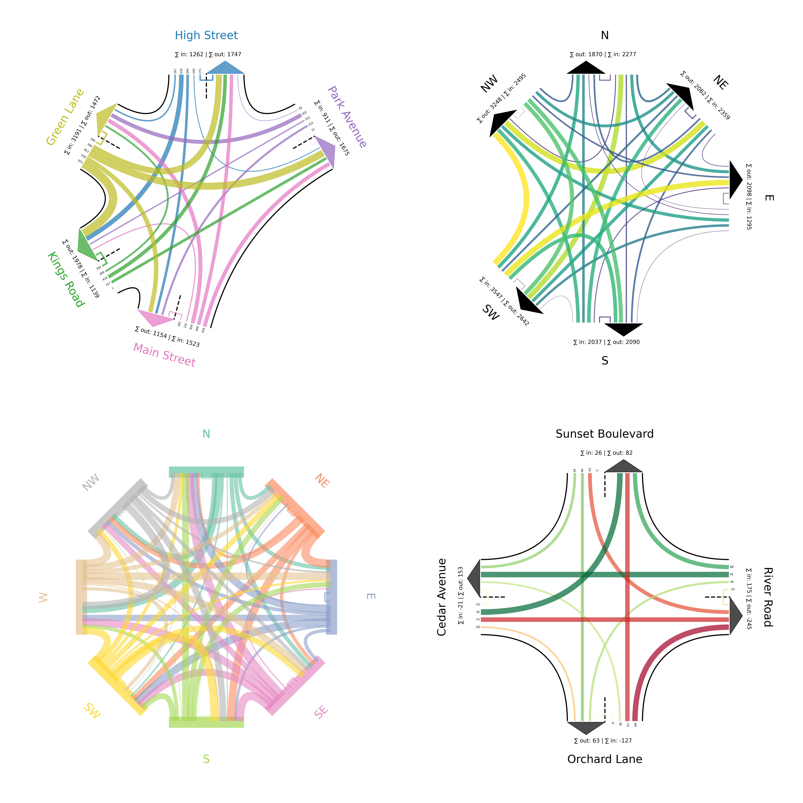
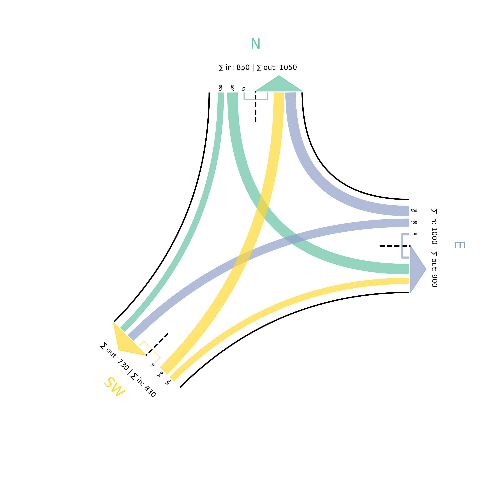

# IntersectionTrafficFlow

## Overview
`IntersectionTrafficFlow` is a Python package designed to visualize traffic flow at intersections, using a directional approach. The visualizations depict various traffic metrics such as volume, direction, and interactions between different flows at an intersection.

## Features
- Customizable traffic flow visualizations with support for various configurations.
- Ability to define custom directions and associate specific traffic metrics with those directions.
- Visual representation of traffic using Matplotlib, allowing easy integration with other data visualization tools in Python.



## Install

### From GitHub
To install `IntersectionTrafficFlow` directly from GitHub, you can use the following pip command:

```bash
pip install git+https://github.com/SeverinHitz/IntersectionTrafficFlow.git
```

### Local Installation

For local development and testing, you can clone the repository and install the package using:

```bash
git clone https://github.com/yourusername/IntersectionTrafficFlow.git
cd IntersectionTrafficFlow
pip install .
```

## quickstart

Here is a simple example of how to use the IntersectionTrafficFlow to create a traffic flow visualization:

```python
import matplotlib.pyplot as plt
from IntersectionTrafficFlow import IntersectionTrafficFlow

# Initialize the traffic flow visualization
itf = IntersectionTrafficFlow()

# Sample data representing origin, destination, and traffic volume
od_matrix = [
    ('N', 'E', 500),
    ('N', 'SW', 300),
    ('N', 'N', 50),
    ('E', 'N', 500),
    ('E', 'E', 100),
    ('E', 'SW', 400),
    ('SW', 'N', 500),
    ('SW', 'E', 300),
    ('SW', 'SW', 30)
]

# Setup plot
fig, ax = plt.subplots()
itf.plot(ax, od_matrix)
plt.show()
```



## License

This project is licensed under the MIT License - see the LICENSE file for details.